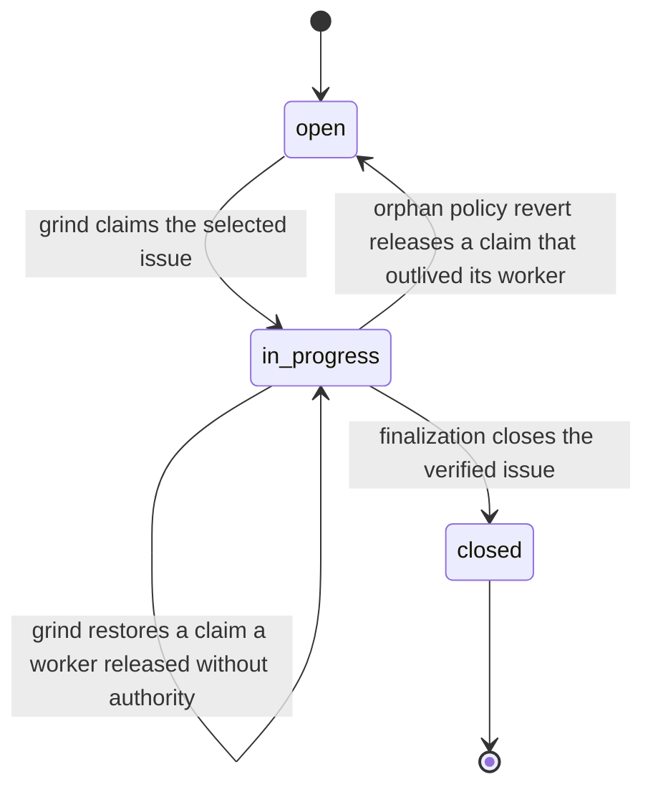

# Ortus

[](https://github.com/who/ortus/actions/workflows/test.yml)

*Ortus* (Latin: "rising, origin, birth") — the point from which something springs into being.

Ortus autonomously closes a backlog of bd-tracked issues using Claude Code or Codex, one fresh subprocess per task. Inspired by the Ralph Loop concept: fresh window per task, drive the queue to zero, no context drift.

## Install

**Requires [uv](https://docs.astral.sh/uv/getting-started/installation/) on PATH.** Ortus is distributed via PyPI and installed by uv; we don't auto-install uv.

**One-liner (recommended):**

```bash
curl -fsSL https://github.com/who/ortus/releases/latest/download/install.sh | sh
```

**Direct PyPI:**

```bash
uv tool install ortus
ortus --version
```

**From source / pinned commit:**

```bash
uv tool install git+https://github.com/who/ortus.git
# Pin a specific tag/branch:
uv tool install 'git+https://github.com/who/ortus.git@v0.1.0'
```

**Troubleshooting:**

| Symptom | Fix |
|---|---|
| `uv: command not found` | Install uv: `curl -LsSf https://astral.sh/uv/install.sh \| sh` (see [uv docs](https://docs.astral.sh/uv/getting-started/installation/)) |
| `ortus: command not found` after install | `uv tool update-shell` then open a new shell |
| `bd: command not found` | `brew install beads` (mac) or grab a release from https://github.com/gastownhall/beads/releases |

## Quick start

```bash
# Install Ortus globally (system-wide — don't add ortus as a project dependency)
curl -fsSL https://github.com/who/ortus/releases/latest/download/install.sh | sh

# Bootstrap YOUR project
cd your-project
ortus init .

# Verify prereqs for the configured backend
ortus check .

# Decompose a PRD into bd issues
ortus plan . path/to/feature.md

# Or run the idea→interview→PRD→tasks flow with no PRD path
ortus plan .

# Drive the bd queue to zero — one task per fresh agent subprocess
ortus grind .

# Override the project backend for one run
ortus grind . --backend codex

# Bounded: stop after N tasks
ortus grind . --tasks 5
```

**Note:** Ortus is a global CLI you install once and use everywhere. You don't clone this repository into your project — `ortus init` only adds a small set of per-project files (`.beads/`, `AGENTS.md`, `.ortusrc`, `.gitignore`, and the selected backend's config directory) to an existing directory. It is not a Python dependency.

## The eight verbs

| Verb | Purpose |
|---|---|
| `ortus init <repo>` | Bootstrap a fresh repo; `--backend claude|codex` selects its default agent |
| `ortus check <repo>` | Verify bd, selected agent, sandbox, and backend config; strictly read-only |
| `ortus plan <repo> [<PRD>]` | Decompose a PRD into bd issues, or interview-then-PRD-then-decompose if no PRD path |
| `ortus grind <repo>` | Drive the bd queue, one task per fresh Claude or Codex subprocess |
| `ortus interview <repo> [<feature-id>]` | Interactive PRD-building interview for an open feature |
| `ortus tail <repo>` | Follow `logs/{grind,goal,ralph}-*.log` with stream-json filtering |
| `ortus triage <repo>` | Walk the human-flagged bd queue interactively |
| `ortus human <repo>` | Render `HUMAN-TODO.md` from bd issues flagged for a human decision |

Run `ortus <verb> --help` for flags. Run `ortus --version` for the installed version.

### Supported platforms

| Platform | Status | Notes |
|---|---|---|
| Linux (Ubuntu/WSL2) | full | requires `bubblewrap` for `ortus grind` |
| macOS | full | Seatbelt (`sandbox-exec`) is built-in |

**Windows is not supported** (decision 2026-05-17). Windows users should run ortus inside **WSL2** (Windows Subsystem for Linux), where ortus runs as a normal Linux process.

## Prerequisites

| Tool | Why | Install |
|---|---|---|
| **uv** | install + run ortus | [docs.astral.sh/uv](https://docs.astral.sh/uv/getting-started/installation/) |
| **bd** (beads) v1.0.0+ | issue tracking (backed by embedded Dolt) | `brew install beads` or [GH release](https://github.com/gastownhall/beads/releases) |
| **claude** or **codex** | agent running inside `ortus grind`; Claude is the default | [Claude Code](https://github.com/anthropics/claude-code) / [Codex CLI](https://github.com/openai/codex) |
| **jq** | bd JSON post-processing | `brew install jq` / `apt install jq` |
| **bwrap** (Linux) or **sandbox-exec** (Mac) | OS-level sandbox for `ortus grind` | `apt install bubblewrap` / built into macOS |

Required: **[CodeGraph](https://github.com/colbymchenry/codegraph)**. `ortus init` installs the index and pins `codegraph = "required"`, `ortus check` reports it as a prerequisite, and `plan`/`grind` abort before launching an agent when it is missing. Ortus probes the project index and CLI, then reconciles those outer signals with CodeGraph MCP calls observed in each agent phase. It never assumes that an index alone means the agent can use the tools. Bootstrap without it — for a repository CodeGraph cannot index — with `ortus init --codegraph off`.

## Agent backends

Claude remains the default. Select Codex at project creation with `ortus init . --backend codex`, per run with `--backend codex`, or through `ORTUS_BACKEND=codex`. Precedence is command-line flag, environment, `.ortusrc`, then the Claude default.

Claude workers run a narrow `claude -p '/goal …'` session. Codex workers run the same logical single-issue task as a **plain** `codex exec '…'` prompt. Codex slash commands belong to its interactive UI; Ortus does not pass a literal `/goal` to `codex exec`. In both cases the outer `ortus grind` scheduler trusts only observable bd state and starts a fresh process for the next issue.

Neither backend's worker may close an issue, commit, or push. Workers leave
uncommitted candidate edits; `ortus grind` itself owns the lifecycle.

Either backend can start from a dirty checkout. Existing changes are treated as
an engineering handoff: the fresh worker receives the selected issue and the
current Git state, assesses which work is useful, and continues instead of
requiring a clean restart. If a worker exits nonzero, is killed, or fails
verification after editing files, the issue and available phase context are
journaled under `logs/`; the next invocation prefers that same issue before
selecting anything new. Journal schema, prior HEAD, path, or hash differences are
audit context rather than automatic startup failures.

Inherited work the worker judges unrelated to the issue stays out of the
candidate: it lists those repo-relative paths in
`logs/grind-unrelated-paths.txt`, and grind leaves them in the worktree — never
reset, stashed, deleted, or committed. When uncommitted work has no journal and
more than one issue is claimed, nothing can decide which goal owns it, so grind
preserves everything and stops with the candidate ids and paths for a human to
route.

A claim left behind with no journal is still a cross-restart orphan, so
`--orphan-policy=warn|revert|escalate` continues to govern it at startup. Its
goal is captured before the sweep runs, so the default `revert` costs nothing —
the loop re-claims the same issue and resumes the same worktree — while
`escalate` hands the issue to a human and leaves the uncommitted work in place.

## Why ortus

- **One install, all projects.** `uv tool install ortus` once; every repo uses the same canonical tooling. No more `copier update` chasing N repos.
- **`bd ready` IS the queue.** No README task lists, no TodoWrite scratchpads. The queue is data.
- **The scheduler is the loop.** Backend output is advisory; observable bd state decides whether an iteration succeeded, orphaned a claim, or made no change.
- **Sandboxed by default.** `ortus grind` refuses to launch unless bwrap/Seatbelt is available; Codex workers retain `workspace-write`, while Claude uses its generated sandbox policy.

## Configuration

Optional `<repo>/.ortusrc` (TOML) overrides `~/.ortusrc`:

```toml
prefix = "myproj"       # bd issue-id prefix
project_type = "python" # python | typescript | go | rust | polyglot
backend = "claude"      # claude | codex
codegraph = "required"  # off | auto | required (default: required)
codegraph_refresh_blocking = false

[profiles.claude.plan]
model = "opus"
reasoning_effort = "high"

[profiles.claude.implement]
model = "sonnet"

[profiles.claude.verify]
model = "opus"
reasoning_effort = "high"

[profiles.claude.finalize]
model = "haiku"

[profiles.codex.implement]
model = "gpt-5.2-codex"
reasoning_effort = "high"
```

Profiles are independent for `plan`, `implement`, `verify`, and `finalize`, and
are scoped to the selected backend. `finalize` is the one bounded, read-only
pass that writes the commit message from the verified diff; it is prose over
material it is handed rather than correctness reasoning, so Claude defaults it
to `haiku` and any failure falls back to the deterministic commit body. Resolution is CLI phase override, then the matching
project table, then the matching user table, then the provider default. Nested
tables merge field by field, so a project can override only `model` while
inheriting `reasoning_effort` from `~/.ortusrc`. Omitted fields add no backend
CLI flags. `ortus plan` accepts `--model` and `--reasoning-effort`; `ortus grind`
accepts `--implement-model`, `--implement-reasoning-effort`, `--verify-model`,
and `--verify-reasoning-effort`. The compatibility `--fast` flag applies only
to Claude implementation workers and never to verification.

### Implementation readiness

`ortus plan` writes executable leaves using readiness schema v1 in the existing
Beads description, design, and acceptance-criteria fields. Leaves must state
their objective and behavioral context; scope and non-goals; concrete files and
symbols; resolved decisions and compatibility constraints; ordered steps,
dependencies, edge cases, and plan-gap handling; and AC-numbered observable
criteria mapped one-to-one to exact checks plus targeted tests. Epics are
containers and are exempt.

After decomposition, `ortus plan` validates every new leaf mechanically. It may
run one fresh repair subprocess with the resolved planning profile, updating
only the named issues in place. A repair that creates replacement issues, or
leaves any packet incomplete, makes planning exit nonzero before work is
claimed.

`ortus grind` applies the same guard immediately before claim. Unready legacy or
manually authored leaves remain open, and their exact missing sections are
printed and written to the grind log for planning or human repair; grind may
continue to a later ready leaf. If implementation discovers a repository
contradiction or unresolved material choice, the worker records a `PLAN-GAP`
comment, preserves candidate edits, flags the issue for human handling, and
stops without committing or closing it.

### Corrections, finalization, and recovery

Each grind iteration is one candidate transaction: a fresh implementation
worker edits, then a fresh read-only verifier reviews the exact candidate and
returns a schema-validated verdict. Every verdict — pass or fail — is written
to the issue as a criterion-by-criterion report before anything else happens.

**Corrections.** A failed verdict starts a bounded retry loop. Each attempt
spawns one fresh implementation worker that receives only the issue id, the
current candidate SHA-256, the failed acceptance criteria, and the verifier's
precise findings — not the transcript, and not the rendered report. Every
correction gets its own fresh verifier. `--max-corrections` bounds the loop
(default 2; `0` disables retries). When the attempts are spent, grind labels
the issue `human`, records an escalation comment, and leaves the candidate
uncommitted and the issue open.

**Plan gaps.** A finding that names an unresolved product or architecture
decision never reaches a correction worker — that would be improvisation. It
routes once through the `plan` profile to repair the packet in place, then to
human escalation. A routing pass may not create, close, or rename issues.

**Finalization.** Only a passing verdict bound to the *current* candidate hash
authorizes it. Grind re-validates issue identity and status, the authoritative
packet, the base commit, the integration branch, report persistence, and the
candidate hash, then performs — itself — four steps in order: write the final
record, close exactly the assigned issue, commit the transaction-owned paths
plus the generated tracker exports, and synchronize the integration branch (a
rejected push retries once behind `git pull --rebase`). Staging is always
path-scoped; grind never runs `git add -A`. Uncommitted work outside the
transaction halts finalization with the exact path list rather than being
swept into the commit.

**Recovery.** Each boundary is journaled under `logs/grind-transaction.json`
after it lands. A run killed between any two boundaries resumes on the next
invocation: grind replays only the outstanding steps, before selecting any new
work, and re-checks observable bd and git state first — so a replayed close,
comment, commit, or push that already happened is a no-op. A blocked
finalization stops the run and keeps the journal rather than moving to another
issue — and it keeps holding the queue on every later run until the blocker is
gone, so clearing the reported cause (say, committing or reverting the
unrelated paths grind named) and re-running finishes the *same* transaction
from the step it stopped at. Grind never abandons an outstanding finalization
to pick up other work.

**Cost.** The floor is two subprocesses per issue (implement + verify). Each
correction adds two more, so `--max-corrections 2` bounds one issue at six;
a plan gap adds one planning-profile pass. Verification runs on the `verify`
profile, which is normally the slow, expensive one — lowering
`--max-corrections` is the cheapest lever on a noisy queue, and
`--verify-model` / `--verify-reasoning-effort` is the next. Omitting the
profile tables entirely keeps every phase on its provider default.

### State graphs

Ortus drives two lifecycles, and they are easy to confuse because both are
spelled as short lowercase strings. A bd issue's status outlives any single
grind run; a candidate journal's `phase` lives only as long as one candidate
transaction. Both are declared as data in `src/ortus/core/lifecycle.py`, and
the block below is generated from that declaration — changing a state without
regenerating it fails the test suite.

<!-- BEGIN GENERATED: state-graph -->
<!-- Generated from src/ortus/core/lifecycle.py. Do not edit by hand: tests/test_state_graph_docs.py fails and prints the correct block. -->

#### bd issue status

The statuses Ortus reads and writes through `bd`. One issue moves through this machine across however many grind runs it takes.



#### Candidate journal phase

`CandidateJournal.phase` for one candidate transaction, from the first worker edit to a committed candidate or a halt a human owns.

```mermaid
stateDiagram-v2
    direction TB
    state "candidate-captured" as candidate_captured
    state "implementation-timeout" as implementation_timeout
    state "implementation-rejected" as implementation_rejected
    state "verification-timeout" as verification_timeout
    state "verification-rejected" as verification_rejected
    state "verified-pass" as verified_pass
    state "verified-fail" as verified_fail
    state "correction-timeout" as correction_timeout
    state "correction-rejected" as correction_rejected
    state "corrections-exhausted" as corrections_exhausted
    state "plan-gap-routed" as plan_gap_routed
    state "plan-gap-escalated" as plan_gap_escalated
    state "orphaned-candidate" as orphaned_candidate
    state "incomplete-candidate" as incomplete_candidate
    state "finalization-blocked" as finalization_blocked
    state "finalized-report" as finalized_report
    state "finalized-close" as finalized_close
    state "finalized-compose" as finalized_compose
    state "finalized-commit" as finalized_commit
    state "finalized-sync" as finalized_sync
    [*] --> implementation
    implementation --> handoff: an unusable journal is rebuilt from the lone claim and the dirty tree
    implementation --> candidate_captured: the worker returned and grind sealed its diff
    implementation --> implementation_timeout: the worker ran out of wall clock
    handoff --> candidate_captured: the resumed worker returned and grind sealed its diff
    handoff --> implementation_timeout: the resumed worker ran out of wall clock
    implementation_timeout --> candidate_captured: a restart resumes the same issue and a fresh worker finishes it
    candidate_captured --> implementation_rejected: the implementation isolation guard refused the candidate
    candidate_captured --> orphaned_candidate: the claim outlived its worker
    candidate_captured --> incomplete_candidate: the worker returned with its claim still open
    candidate_captured --> finalizing: legacy condition mode; the Codex worker closed the issue itself
    candidate_captured --> verification: a fresh read-only verifier starts
    implementation_rejected --> candidate_captured: a restart re-implements the rejected candidate
    verification --> verified_pass: the verifier returned a passing verdict
    verification --> verified_fail: the verifier returned a failing verdict
    verification --> verification_rejected: the verifier produced no usable verdict, or moved the candidate
    verification --> verification_timeout: the verifier ran out of wall clock with the candidate intact
    verification_timeout --> verification: a restart re-verifies the preserved candidate
    verification_timeout --> correction_rejected: a correction had already been spent on this candidate
    verification_rejected --> candidate_captured: a restart re-implements after a rejected verification
    verification_rejected --> correction_rejected: a correction had already been spent on this candidate
    verified_fail --> correction: a correction attempt remains in the budget
    verified_fail --> corrections_exhausted: the bounded correction budget is spent
    verified_fail --> plan_gap_routed: the findings name a planning gap; one planning pass is spent
    verified_fail --> plan_gap_escalated: the planning gap survived its one planning pass
    correction --> candidate_captured: the correction worker returned and grind re-sealed the diff
    correction --> correction_timeout: the correction worker ran out of wall clock
    correction_timeout --> candidate_captured: a restart re-implements the timed-out correction
    plan_gap_routed --> candidate_captured: a restart re-implements against the replanned issue
    verified_pass --> finalized_report: finalization boundary report landed
    verified_pass --> finalization_blocked: a finalization precondition failed
    finalized_report --> finalized_close: finalization boundary close landed
    finalized_close --> finalized_compose: finalization boundary compose landed
    finalized_compose --> finalized_commit: finalization boundary commit landed
    finalized_commit --> finalized_sync: finalization boundary sync landed
    finalized_report --> finalization_blocked: a finalization precondition failed on replay
    finalized_close --> finalization_blocked: a finalization precondition failed on replay
    finalized_compose --> finalization_blocked: a finalization precondition failed on replay
    finalized_commit --> finalization_blocked: a finalization precondition failed on replay
    finalization_blocked --> finalized_report: a restart replays the first boundary that has not landed
    finalization_blocked --> finalized_close: a restart replays the first boundary that has not landed
    finalization_blocked --> finalized_compose: a restart replays the first boundary that has not landed
    finalization_blocked --> finalized_commit: a restart replays the first boundary that has not landed
    finalization_blocked --> finalized_sync: a restart replays the first boundary that has not landed
    correction_rejected --> [*]
    corrections_exhausted --> [*]
    plan_gap_escalated --> [*]
    orphaned_candidate --> [*]
    incomplete_candidate --> [*]
    finalizing --> [*]
    finalized_sync --> [*]
```



#### Where the two machines meet

| Candidate phase | Issue status | What it means |
| --- | --- | --- |
| `finalized-close` | in_progress -> closed | Only finalization closes an issue, and only after a fresh verifier passed the candidate. |
| `finalizing` | already closed | Legacy condition mode: the Codex worker closed the issue itself, so grind only commits the owned paths behind it. |
| `orphaned-candidate, implementation-timeout` | in_progress -> open | Orphan policy `revert` releases the claim; the candidate stays in the worktree and the journal keeps the issue association, so the next run re-claims the same issue. |
| `plan-gap-escalated, corrections-exhausted, correction-rejected` | stays in_progress, labelled `human` | A halt a human owns: no close, no commit. The issue keeps its claim so nothing else selects it. |
| `verification, correction` | in_progress -> in_progress | A worker that changed the status despite the phase contract cannot make that stick; grind restores the claim before continuing. |

`startup`, `pre-iter`, `post-close`, `post-housekeeping` are *not* journal phases. They are the `phase=` argument of grind's branch-discipline logging, and they never reach a journal; neither does `idle`, which a run snapshot reports when no journal exists at all.
<!-- END GENERATED: state-graph -->

### CodeGraph lifecycle

`required` is the default. It fails before agent launch when `.codegraph/` or
the `codegraph` CLI is missing, fails when a phase transcript contains no
CodeGraph MCP capability handshake, and blocks verification if the post-edit
`codegraph sync` fails. `auto` stays selectable for a best-effort posture:
planning and each grind issue transaction emit a clear activation or fallback
decision, and missing or unhealthy CodeGraph falls back to grep/Read. `off`
performs no CodeGraph calls and reports that it is disabled — it is the escape
hatch for a repository CodeGraph cannot index.

`ortus init` builds the index, writes the resolved policy into `.ortusrc`, and
gitignores `.codegraph/` (the index is local, machine-specific, and often
large). Because it is gitignored, a fresh clone has no index: run
`codegraph init` once, which `ortus check` names as the remediation. Register
the CodeGraph MCP server for the selected Claude or Codex backend. Planning
validates issue packets,
implementation confirms references and runs impact analysis, the parent refreshes
the index after candidate edits, and a fresh verifier independently checks changed
symbols and callers.

```text
[ortus grind] CodeGraph probe (mode=required)
error: CodeGraph required but unavailable: project index .codegraph/ is missing.
```

Logs retain bounded `ortus.codegraph` JSON records rendered by `ortus tail` as
`[CODEGRAPH]` lines. Plan-created issues and verifier comments retain a
`CodeGraph engagement v1` block with availability, freshness, tool/query totals,
reviewed symbols, impacted and out-of-scope callers, misses, fallbacks, and caps.
Full query payloads and source text are excluded.

Troubleshooting: a missing index means run `codegraph init` and `codegraph sync`;
a missing CLI means install it; a missing handshake means the selected backend
has not registered the CodeGraph MCP server. Auto mode records the fallback and
continues. Required mode stops with an actionable diagnostic.

**Migrating an existing project.** A repo whose `.ortusrc` has no `codegraph`
key now inherits `required` and will stop at the probe until CodeGraph is in
place. Run `ortus check` to see which prerequisite is missing, then either
install the CLI and run `codegraph init`, or pin the previous behavior
explicitly with `codegraph = "auto"` (or `codegraph = "off"`) in `.ortusrc`.
Projects that already pin an explicit value are unaffected.

Per-repo or user-wide prompt overrides live at `<repo>/.ortus/prompts/<name>.md` or `~/.ortus/prompts/<name>.md`; the bundled defaults under `src/ortus/prompts/` are the fallback (FR-025).

## Session-close protocol

When ending a work session, push your work:

```bash
bd close <id> --reason "..."
git add -A && git commit -m "..."
bd dolt push
git push
```

Work is not done until pushed. The generated `AGENTS.md` repeats this in every project.

## Development

```bash
# Local editable install
uv pip install -e '.[dev]'

# Tests
uv run pytest -m fast --test-timeout=30 --enforce-duration-budget
uv run pytest -m integration --test-timeout=60 --enforce-duration-budget
```

See [the test-gate guide](docs/testing.md) for changed-path selection,
verifier expansion, CI timing evidence, and tagged network/live-provider
release smoke.

## License

MIT
