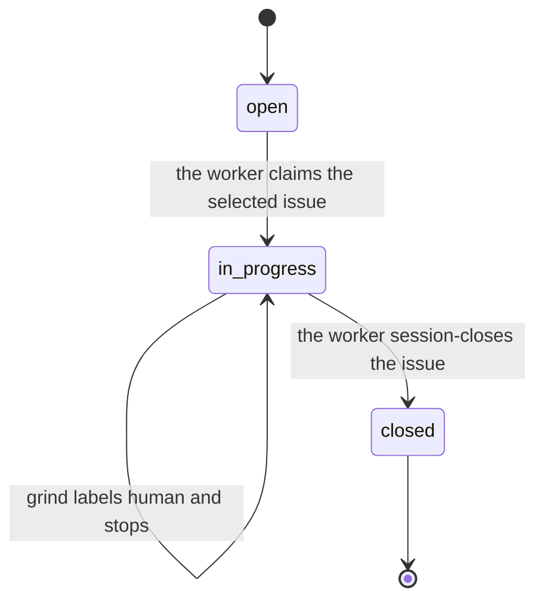

# Ortus

[](https://github.com/who/ortus/actions/workflows/test.yml)

*Ortus* (Latin: "rising, origin, birth") — the point from which something springs into being.

Ortus autonomously closes a backlog of bd-tracked issues using Claude Code, Codex, or Grok, one fresh subprocess per task. Inspired by the Ralph Loop concept: fresh window per task, drive the queue to zero, no context drift.

## Install

**Requires [uv](https://docs.astral.sh/uv/getting-started/installation/) on PATH.** Ortus is distributed via PyPI and installed by uv; we don't auto-install uv.

**One-liner (recommended):**

```bash
curl -fsSL https://github.com/who/ortus/releases/latest/download/install.sh | sh
```

**Direct PyPI:**

```bash
uv tool install ortus
ortus --version
```

**From source / pinned commit:**

```bash
uv tool install git+https://github.com/who/ortus.git
# Pin a specific tag/branch:
uv tool install 'git+https://github.com/who/ortus.git@v0.1.0'
```

**Troubleshooting:**

| Symptom | Fix |
|---|---|
| `uv: command not found` | Install uv: `curl -LsSf https://astral.sh/uv/install.sh \| sh` (see [uv docs](https://docs.astral.sh/uv/getting-started/installation/)) |
| `ortus: command not found` after install | `uv tool update-shell` then open a new shell |
| `bd: command not found` | `brew install beads` (mac) or grab a release from https://github.com/gastownhall/beads/releases |

## Quick start

```bash
# Install Ortus globally (system-wide — don't add ortus as a project dependency)
curl -fsSL https://github.com/who/ortus/releases/latest/download/install.sh | sh

# Bootstrap YOUR project
cd your-project
ortus init .

# Verify prereqs for the configured backend
ortus check .

# Decompose a PRD into bd issues
ortus plan . path/to/feature.md

# Or run the idea→interview→PRD→tasks flow with no PRD path
ortus plan .

# Drive the bd queue to zero — one task per fresh agent subprocess
ortus grind .

# Override the project backend for one run
ortus grind . --backend codex

# Bounded: stop after N tasks
ortus grind . --tasks 5
```

**Note:** Ortus is a global CLI you install once and use everywhere. You don't clone this repository into your project — `ortus init` only adds a small set of per-project files (`.beads/`, `AGENTS.md`, `.ortusrc`, `.gitignore`, and the selected backend's config directory) to an existing directory. It is not a Python dependency.

## The verbs

| Verb | Purpose |
|---|---|
| `ortus init <repo>` | Bootstrap a fresh repo; `--backend claude|codex|grok` selects its default agent |
| `ortus check <repo>` | Verify bd, selected agent, sandbox, and backend config; strictly read-only |
| `ortus plan <repo> [<PRD>]` | Decompose a PRD into bd issues, or interview-then-PRD-then-decompose if no PRD path |
| `ortus grind <repo>` | Drive the bd queue, one task per fresh Claude, Codex, or Grok subprocess |
| `ortus interview <repo> [<feature-id>]` | Interactive PRD-building interview for an open feature |
| `ortus tail <repo>` | Follow `logs/grind-*.log` with stream-json filtering |
| `ortus human <repo>` | Render `HUMAN-TODO.md` from bd issues flagged for a human decision |
| `ortus dashboard <repo>` | Watch one grind run in a read-only live view |
| `ortus spec` | Print the readiness schema issue-authoring contract |
| `ortus unlock <repo>` | Clear a stuck grind flock; optionally revert in-progress claims |

Run `ortus <verb> --help` for flags. Run `ortus --version` for the installed version.

### Supported platforms

| Platform | Status | Notes |
|---|---|---|
| Linux (Ubuntu/WSL2) | full | requires `bubblewrap` for `ortus grind` |
| macOS | full | Seatbelt (`sandbox-exec`) is built-in |

**Windows is not supported** (decision 2026-05-17). Windows users should run ortus inside **WSL2** (Windows Subsystem for Linux), where ortus runs as a normal Linux process.

## Prerequisites

| Tool | Why | Install |
|---|---|---|
| **uv** | install + run ortus | [docs.astral.sh/uv](https://docs.astral.sh/uv/getting-started/installation/) |
| **bd** (beads) v1.0.0+ | issue tracking (Dolt-backed) | `brew install beads` or [GH release](https://github.com/gastownhall/beads/releases) |
| **claude**, **codex**, or **grok** | agent running inside `ortus grind`; Claude is the default | [Claude Code](https://github.com/anthropics/claude-code) / [Codex CLI](https://github.com/openai/codex) / Grok Build |
| **jq** | bd JSON post-processing | `brew install jq` / `apt install jq` |
| **bwrap** (Linux) or **sandbox-exec** (Mac) | OS-level sandbox for `ortus grind` | `apt install bubblewrap` / built into macOS |

Required: **[CodeGraph](https://github.com/colbymchenry/codegraph)**. `ortus init` installs the index and pins `codegraph = "required"`, `ortus check` reports it as a prerequisite, and `plan`/`grind` abort before launching an agent when it is missing. Ortus probes the project index and CLI, then reconciles those outer signals with CodeGraph MCP calls observed in each agent phase. It never assumes that an index alone means the agent can use the tools. Bootstrap without it — for a repository CodeGraph cannot index — with `ortus init --codegraph off`.

## Agent backends

Claude remains the default. Select Codex or Grok at project creation with `ortus init . --backend codex` or `--backend grok`, per run with `--backend`, or through `ORTUS_BACKEND`. Precedence is command-line flag, environment, `.ortusrc`, then the Claude default.

Claude and Grok workers run a narrow `/goal` session (`claude -p '/goal …'` or `grok -p`; Grok is headless, not a TUI). The landed Q1 finding is EXPANDS, so Ortus wraps the Grok task in `/goal` the same way as Claude. Codex workers run the same logical single-issue task as a **plain** `codex exec '…'` prompt. Codex slash commands belong to its interactive UI; Ortus does not pass a literal `/goal` to `codex exec`.

The worker implements the issue, runs its acceptance checks, and session-closes: it commits the paths it owns, `bd close`s the issue, `bd dolt push`es, and `git push`es. `ortus grind` selects the work, launches one fresh process, and trusts only observable bd and git state — it reaps the worker once a new issue is closed and HEAD is in sync with origin.

Any backend can start from a dirty checkout. Existing changes are treated as
inherited dirty paths: the fresh worker receives the selected issue and the
current Git state, assesses which work is useful, and continues instead of
requiring a clean restart. If a worker exits nonzero, is killed, or fails
verification after editing files, the issue and available context are
recorded under `logs/`; the next invocation prefers that same issue before
selecting anything new. Schema, prior HEAD, path, or hash differences are
audit context rather than automatic startup failures.

Inherited work the worker judges unrelated to the issue stays out of the
owned paths: it lists those repo-relative paths in
`logs/grind-unrelated-paths.txt`, and grind leaves them in the worktree — never
reset, stashed, deleted, or committed. When uncommitted work has no run record and
more than one issue is claimed, nothing can decide which goal owns it, so grind
preserves everything and stops with the issue ids and paths for a human to
route.

A claim left unfinished is leftover `in_progress`, not an orphan: the next
grind continues that id. `--orphan-policy=escalate` still labels it `human`
and leaves the tree untouched. `revert` is remapped to warn so it cannot
bounce the claim back to `open`.

## Why ortus

- **One install, all projects.** `uv tool install ortus` once; every repo uses the same canonical tooling. No per-repo vendor copies to chase.
- **`bd ready` IS the queue.** No README task lists, no TodoWrite scratchpads. The queue is data.
- **The scheduler is the loop.** Backend output is advisory; observable bd state decides whether an iteration succeeded, orphaned a claim, or made no change.
- **Sandboxed by default.** `ortus grind` refuses to launch unless bwrap/Seatbelt is available; Codex workers retain `workspace-write`, Claude uses its generated sandbox policy, and Grok uses its native `--sandbox workspace` (not wrapped in bwrap).

## Configuration

Optional `<repo>/.ortusrc` (TOML) overrides `~/.ortusrc`:

```toml
prefix = "myproj"       # bd issue-id prefix
project_type = "python" # python | typescript | go | rust | polyglot
backend = "claude"      # claude | codex | grok
codegraph = "required"  # off | auto | required (default: required)
codegraph_refresh_blocking = false
merge_gate = false      # wait for issue-branch checks before fast-forward
merge_gate_timeout = 1800  # seconds; timeout blocks, never lands

[profiles.claude.plan]
model = "opus"
reasoning_effort = "high"

[profiles.claude.implement]
model = "sonnet"

[profiles.claude.verify]
model = "opus"
reasoning_effort = "high"

[profiles.claude.finalize]
model = "haiku"

[profiles.codex.implement]
model = "gpt-5.2-codex"
reasoning_effort = "high"
```

Profiles are independent for `plan`, `implement`, `verify`, and `finalize`, and
are scoped to the selected backend. `finalize` is the one bounded, read-only
pass that writes the commit message from the verified diff; it is prose over
material it is handed rather than correctness reasoning, so Claude defaults it
to `haiku` and any failure falls back to the deterministic commit body. Resolution is CLI phase override, then the matching
project table, then the matching user table, then the provider default. Nested
tables merge field by field, so a project can override only `model` while
inheriting `reasoning_effort` from `~/.ortusrc`. Omitted fields add no backend
CLI flags. `ortus plan` accepts `--model` and `--reasoning-effort`; `ortus grind`
accepts `--implement-model`, `--implement-reasoning-effort`, `--verify-model`,
and `--verify-reasoning-effort`. The compatibility `--fast` flag applies only
to Claude implementation workers and never to verification.

### Implementation readiness

`ortus plan` writes executable tasks using readiness schema v1 in the existing
Beads description, design, and acceptance-criteria fields. Tasks must state
their objective and behavioral context; scope and non-goals; concrete files and
symbols; resolved decisions and compatibility constraints; ordered steps,
dependencies, edge cases, and planning-gap handling; and AC-numbered observable
criteria mapped one-to-one to exact checks plus targeted tests. Epics are
containers and are exempt.

After decomposition, `ortus plan` validates every new task mechanically. It may
run one fresh repair subprocess with the resolved planning profile, updating
only the named issues in place. A repair that creates replacement issues, or
leaves any work spec incomplete, makes planning exit nonzero before work is
claimed.

`ortus grind` applies the same guard immediately before claim. Unready legacy or
manually authored tasks remain open, and their exact missing sections are
printed and written to the grind log for planning or human repair; grind may
continue to a later ready task. If implementation discovers a repository
contradiction or unresolved material choice, the worker records a `PLAN-GAP`
comment, preserves owned-path edits, flags the issue for human handling, and
stops without committing or closing it.

### How a grind iteration finishes

Each iteration is one fresh worker on one issue. The worker implements the
packet, runs the issue's acceptance checks, and session-closes: it commits
only the paths it owns, closes the issue, and pushes. Grind does not close,
commit, or push on the worker's behalf.

Grind watches observable state. When the closed-issue count has grown since
spawn and HEAD is in sync with origin, it reaps the worker and starts the
next ready issue. A worker that exits without closing leaves the claim
`in_progress`; grind does not treat that as success.

`--tasks N` still bounds how many issues one invocation will drive. An issue
the worker cannot finish stays open or `in_progress` for the next run or for
a human. A finding that names an unresolved product or architecture decision
is a planning gap: the worker records `PLAN-GAP`, leaves the claim, and does
not invent an answer.

### State graphs

A bd issue's status outlives any single grind run. The diagram below is
how that status moves under `/goal` grind: the worker claims, session-closes,
or leaves the claim `in_progress` for the next window or a human. It is
generated from `src/ortus/core/lifecycle.py` — changing a status without
regenerating it fails the test suite.

<!-- BEGIN GENERATED: state-graph -->
<!-- Generated from src/ortus/core/lifecycle.py. Do not edit by hand: tests/test_state_graph_docs.py fails and prints the correct block. -->

#### bd issue status

The statuses Ortus reads and writes through `bd`. A worker claims an open issue, session-closes it, or leaves the claim in_progress for the next window or a human. Leftover in_progress is not reverted to open.



<details><summary>Every issue transition (4)</summary>

| From | Trigger | To |
| --- | --- | --- |
| `open` | the worker claims the selected issue | `in_progress` |
| `in_progress` | the leftover claim continues in the next window | `in_progress` |
| `in_progress` | grind labels human and stops | `in_progress` |
| `in_progress` | the worker session-closes the issue | `closed` |

</details>
<!-- END GENERATED: state-graph -->

### CodeGraph lifecycle

`required` is the default. It fails before agent launch when `.codegraph/` or
the `codegraph` CLI is missing, fails when a phase transcript contains no
CodeGraph MCP capability handshake, and blocks verification if the post-edit
`codegraph sync` fails. `auto` stays selectable for a best-effort posture:
planning and each grind issue transaction emit a clear activation or fallback
decision, and missing or unhealthy CodeGraph falls back to grep/Read. `off`
performs no CodeGraph calls and reports that it is disabled — it is the escape
hatch for a repository CodeGraph cannot index.

`ortus init` builds the index, writes the resolved policy into `.ortusrc`, and
gitignores `.codegraph/` (the index is local, machine-specific, and often
large). Because it is gitignored, a fresh clone has no index: run
`codegraph init` once, which `ortus check` names as the remediation. Register
the CodeGraph MCP server for the selected Claude, Codex, or Grok backend. Planning
validates work specs,
implementation confirms references and runs impact analysis, the parent refreshes
the index after owned-path edits, and a fresh verifier independently checks changed
symbols and callers.

```text
[2026-08-08 13:28:45] CodeGraph probe (mode=required)
error: CodeGraph required but unavailable: project index .codegraph/ is missing.
```

Logs retain bounded `ortus.codegraph` JSON records rendered by `ortus tail` as
`[CODEGRAPH]` lines. Plan-created issues and verifier comments retain a
`CodeGraph engagement v1` block with availability, freshness, tool/query totals,
reviewed symbols, impacted and out-of-scope callers, misses, fallbacks, and caps.
Full query payloads and source text are excluded.

Troubleshooting: a missing index means run `codegraph init` and `codegraph sync`;
a missing CLI means install it; a missing handshake means the selected backend
has not registered the CodeGraph MCP server. Auto mode records the fallback and
continues. Required mode stops with an actionable diagnostic.

**Migrating an existing project.** A repo whose `.ortusrc` has no `codegraph`
key now inherits `required` and will stop at the probe until CodeGraph is in
place. Run `ortus check` to see which prerequisite is missing, then either
install the CLI and run `codegraph init`, or pin the previous behavior
explicitly with `codegraph = "auto"` (or `codegraph = "off"`) in `.ortusrc`.
Projects that already pin an explicit value are unaffected.

Per-repo or user-wide prompt overrides live at `<repo>/.ortus/prompts/<name>.md` or `~/.ortus/prompts/<name>.md`; the bundled defaults under `src/ortus/prompts/` are the fallback.

## Glossary

Ortus's vocabulary is small, load-bearing, and largely made of standard
software-engineering terms carrying one specific sense — a work spec is
authored issue content, not a message on a queue; a session-close is the
worker's own commit, close and push at the end of one issue. These words appear in log lines, prompt contracts and error messages,
so guessing at one misreads the run. The table below is generated from the
declaration in `src/ortus/core/glossary.py`; changing a term without
regenerating it fails the test suite.

<!-- BEGIN GENERATED: glossary -->
<!-- Generated from src/ortus/core/glossary.py. Do not edit by hand: tests/test_glossary_docs.py fails and prints the correct block. -->

| Term | What it means | On a team without agents | Analogy | Where it lives |
| --- | --- | --- | --- | --- |
| **orphan** | An issue left claimed but unclosed by a worker that ended without finishing, which the configured orphan policy then releases or keeps. | A ticket left In Progress by someone who went on holiday without updating the board. | A library book still on loan to someone who has left town and is not coming back for it. | `src/ortus/core/grind_loop.py` |
| **planning gap** | A defect in the work spec that no amount of implementing can resolve, which routes back to planning instead of shipping the issue. | A developer handing a ticket back to the analyst because it cannot be built as written. | A builder downing tools because the blueprint gives no dimension for a wall. No amount of building resolves it. | `PLAN_GAP_ROUTED` in `src/ortus/core/lifecycle.py` |
| **readiness** | The schema an issue must satisfy before an implementation worker may be launched at it, checked mechanically when the issue is planned. | Definition of Ready: the checklist a story passes before planning will let anyone start it. | The pre-flight checklist an aircraft passes before pushback, not an opinion about whether it looks ready. | `validate_issue()` in `src/ortus/core/readiness.py` |
| **session-close** | The worker's own commit, bd close, bd dolt push and git push at the end of one issue, after which grind reaps. | The developer closing their own ticket after the checks they ran, not a release manager doing it for them. | The couple signing their own register. The registrar is not in the room. | `src/ortus/prompts/goal-prompt.md` step 4 |
| **task** | A non-epic bd issue small and complete enough for one implementation worker to execute end to end, which is what readiness validates. | A story an engineer can finish in one sitting, as opposed to an epic that has to be broken down first. | An errand you can finish on one trip, rather than a house move that has to be broken into trips first. | `src/ortus/core/readiness.py` |
| **work spec** | The authored bd issue content — description, design, acceptance criteria, notes — that a worker treats as authoritative, not any message on a queue. | The ticket as the analyst wrote it: the spec of record a developer builds from and argues with, not a chat message. | The blueprint handed to the builder. What is on the paper governs, not what anyone remembers saying. | `src/ortus/core/readiness.py` |
| **worker** | One agent subprocess that implements one issue end to end — including its acceptance checks and session-close — started fresh with no memory of any worker before it. | A contractor hired for exactly one ticket, who has never seen the codebase before and will not be back. | A temp who works exactly one shift, has never seen the building before, and will not be back tomorrow. | `compose_worker_prompt()` in `src/ortus/core/agent.py` |
<!-- END GENERATED: glossary -->

## Session-close protocol

When ending a work session, push your work:

```bash
bd close <id> --reason "..."
git add <owned-paths> && git commit -m "..."
bd dolt push
git push
```

Commit only the paths you own — never `git add -A`. Work is not done until pushed. The generated `AGENTS.md` repeats this in every project.

## Development

```bash
# Local install
uv sync --all-extras

# Tests
uv run pytest -m fast -n auto --test-timeout=30
uv run pytest -m integration -n auto --test-timeout=60
```

See [the test-gate guide](docs/testing.md) for changed-path selection,
verifier expansion, CI timing evidence, and tagged network/live-provider
release smoke.

## License

MIT
